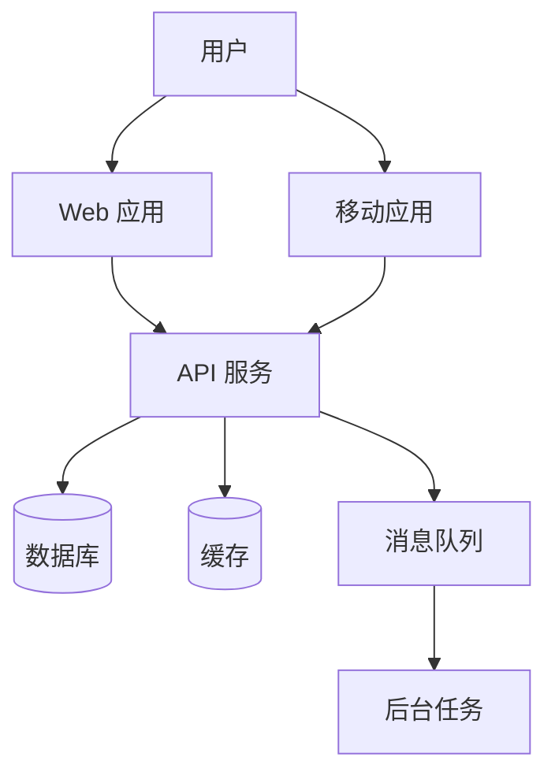
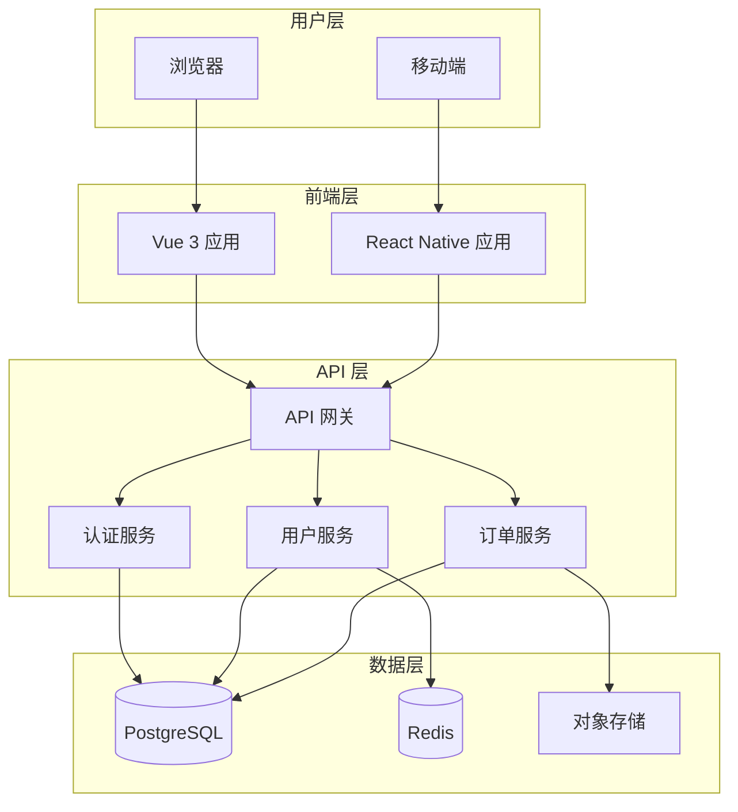
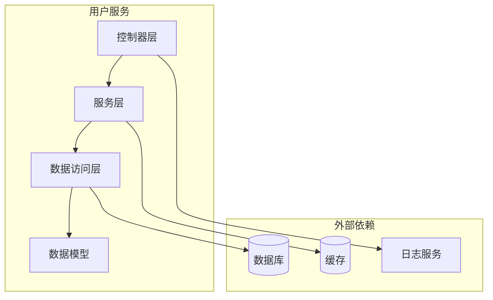

# 代码文档专家参考

> Reference for: fullstack-dev-skills
> Load when: 用户请求 API 文档、内联文档、架构图、文档生成

## 核心特性

代码文档是项目可维护性的基石：
- 提高代码可读性和可理解性
- 降低新成员上手成本
- 促进团队协作与知识传递
- 支持自动化文档生成
- 增强代码自描述能力

## JSDoc 中文注释规范

### 基础注释格式

```typescript
/**
 * 用户服务类
 * @description 提供用户相关的业务逻辑处理
 * @author 开发团队
 * @version 1.0.0
 */
export class UserService {
  private userRepository: UserRepository;

  /**
   * 构造函数
   * @param userRepository - 用户数据仓库实例
   */
  constructor(userRepository: UserRepository) {
    this.userRepository = userRepository;
  }

  /**
   * 根据ID获取用户信息
   * @param id - 用户唯一标识符
   * @returns 用户信息对象，未找到时返回 null
   * @throws {NotFoundError} 当用户不存在时抛出
   * @example
   * ```typescript
   * const user = await userService.getUserById('123');
   * console.log(user.name);
   * ```
   */
  async getUserById(id: string): Promise<User | null> {
    return await this.userRepository.findById(id);
  }

  /**
   * 创建新用户
   * @param userData - 用户创建数据
   * @param userData.name - 用户姓名
   * @param userData.email - 用户邮箱
   * @param userData.password - 用户密码（已加密）
   * @returns 创建成功的用户对象
   */
  async createUser(userData: CreateUserData): Promise<User> {
    return await this.userRepository.create(userData);
  }
}
```

### 复杂类型注释

```typescript
/**
 * 用户配置选项
 */
interface UserConfig {
  /** 用户显示名称，最大长度50字符 */
  displayName: string;
  
  /** 用户邮箱地址，需符合邮箱格式 */
  email: string;
  
  /** 
   * 用户角色列表
   * @default ['user']
   */
  roles: string[];
  
  /** 
   * 账户是否激活
   * @readonly
   */
  isActive: boolean;
  
  /** 用户偏好设置 */
  preferences: {
    /** 主题模式 */
    theme: 'light' | 'dark';
    /** 语言设置 */
    language: string;
    /** 通知偏好 */
    notifications: {
      /** 邮件通知开关 */
      email: boolean;
      /** 推送通知开关 */
      push: boolean;
    };
  };
}

/**
 * API 响应泛型类型
 * @template T - 响应数据类型
 */
interface ApiResponse<T> {
  /** 响应状态码 */
  code: number;
  /** 响应消息 */
  message: string;
  /** 响应数据 */
  data: T;
  /** 服务器时间戳 */
  timestamp: number;
}
```

### 函数重载注释

```typescript
/**
 * 格式化日期
 * @param date - 日期对象
 * @returns 格式化后的日期字符串
 * 
 * @example
 * ```typescript
 * formatDate(new Date()); // '2024-01-15'
 * ```
 */
function formatDate(date: Date): string;

/**
 * 格式化日期
 * @param timestamp - 时间戳（毫秒）
 * @returns 格式化后的日期字符串
 * 
 * @example
 * ```typescript
 * formatDate(1705312800000); // '2024-01-15'
 * ```
 */
function formatDate(timestamp: number): string;

/**
 * 格式化日期
 * @param dateString - 日期字符串
 * @param format - 输出格式
 * @returns 格式化后的日期字符串
 * 
 * @example
 * ```typescript
 * formatDate('2024-01-15', 'YYYY年MM月DD日'); // '2024年01月15日'
 * ```
 */
function formatDate(dateString: string, format: string): string;

/**
 * 格式化日期实现
 */
function formatDate(input: Date | number | string, format?: string): string {
  let date: Date;
  
  if (input instanceof Date) {
    date = input;
  } else if (typeof input === 'number') {
    date = new Date(input);
  } else {
    date = new Date(input);
  }
  
  const year = date.getFullYear();
  const month = String(date.getMonth() + 1).padStart(2, '0');
  const day = String(date.getDate()).padStart(2, '0');
  
  if (format) {
    return format
      .replace('YYYY', String(year))
      .replace('MM', month)
      .replace('DD', day);
  }
  
  return `${year}-${month}-${day}`;
}
```

## API 文档生成

### OpenAPI/Swagger 规范

```yaml
openapi: 3.0.3
info:
  title: 用户管理 API
  description: 提供用户注册、登录、信息管理等功能
  version: 1.0.0
  contact:
    name: API 支持
    email: support@example.com

servers:
  - url: https://api.example.com/v1
    description: 生产环境
  - url: https://api-dev.example.com/v1
    description: 开发环境

paths:
  /users:
    get:
      summary: 获取用户列表
      description: 分页获取系统中的用户列表
      operationId: getUsers
      tags:
        - 用户管理
      parameters:
        - name: page
          in: query
          description: 页码
          required: false
          schema:
            type: integer
            default: 1
        - name: pageSize
          in: query
          description: 每页数量
          required: false
          schema:
            type: integer
            default: 10
            maximum: 100
      responses:
        '200':
          description: 成功获取用户列表
          content:
            application/json:
              schema:
                $ref: '#/components/schemas/UserListResponse'
        '401':
          $ref: '#/components/responses/Unauthorized'
        '500':
          $ref: '#/components/responses/InternalError'

    post:
      summary: 创建用户
      description: 创建新的用户账户
      operationId: createUser
      tags:
        - 用户管理
      requestBody:
        required: true
        content:
          application/json:
            schema:
              $ref: '#/components/schemas/CreateUserRequest'
      responses:
        '201':
          description: 用户创建成功
          content:
            application/json:
              schema:
                $ref: '#/components/schemas/UserResponse'
        '400':
          $ref: '#/components/responses/BadRequest'
        '409':
          description: 邮箱已被注册

  /users/{id}:
    get:
      summary: 获取用户详情
      operationId: getUserById
      tags:
        - 用户管理
      parameters:
        - name: id
          in: path
          required: true
          description: 用户ID
          schema:
            type: string
            format: uuid
      responses:
        '200':
          description: 成功获取用户信息
          content:
            application/json:
              schema:
                $ref: '#/components/schemas/UserResponse'
        '404':
          $ref: '#/components/responses/NotFound'

components:
  schemas:
    User:
      type: object
      properties:
        id:
          type: string
          format: uuid
          description: 用户唯一标识
        name:
          type: string
          description: 用户姓名
          maxLength: 50
        email:
          type: string
          format: email
          description: 用户邮箱
        createdAt:
          type: string
          format: date-time
          description: 创建时间

    CreateUserRequest:
      type: object
      required:
        - name
        - email
        - password
      properties:
        name:
          type: string
          description: 用户姓名
          example: 张三
        email:
          type: string
          format: email
          description: 用户邮箱
          example: zhangsan@example.com
        password:
          type: string
          format: password
          description: 用户密码
          minLength: 8

    UserResponse:
      type: object
      properties:
        code:
          type: integer
          example: 200
        message:
          type: string
          example: success
        data:
          $ref: '#/components/schemas/User'

    UserListResponse:
      type: object
      properties:
        code:
          type: integer
        message:
          type: string
        data:
          type: object
          properties:
            items:
              type: array
              items:
                $ref: '#/components/schemas/User'
            total:
              type: integer
            page:
              type: integer
            pageSize:
              type: integer

  responses:
    BadRequest:
      description: 请求参数错误
      content:
        application/json:
          schema:
            type: object
            properties:
              code:
                type: integer
                example: 400
              message:
                type: string
                example: 参数验证失败

    Unauthorized:
      description: 未授权访问
      content:
        application/json:
          schema:
            type: object
            properties:
              code:
                type: integer
                example: 401
              message:
                type: string
                example: 请先登录

    NotFound:
      description: 资源不存在
      content:
        application/json:
          schema:
            type: object
            properties:
              code:
                type: integer
                example: 404
              message:
                type: string
                example: 资源不存在

    InternalError:
      description: 服务器内部错误
      content:
        application/json:
          schema:
            type: object
            properties:
              code:
                type: integer
                example: 500
              message:
                type: string
                example: 服务器内部错误
```

### TypeDoc 配置

```json
{
  "typedocOptions": {
    "entryPoints": ["src/index.ts"],
    "out": "docs/api",
    "plugin": ["typedoc-plugin-markdown"],
    "readme": "none",
    "gitRevision": "main",
    "excludePrivate": true,
    "excludeProtected": false,
    "excludeExternals": true,
    "includeVersion": true,
    "name": "项目 API 文档",
    "navigation": {
      "includeCategories": true,
      "includeGroups": true
    },
    "visibilityFilters": {
      "protected": true,
      "private": false,
      "inherited": true,
      "external": false
    }
  }
}
```

## 架构文档

### C4 架构图

```markdown
## 系统架构文档

### 1. 系统上下文图 (System Context)



### 2. 容器图 (Container Diagram)



### 3. 组件图 (Component Diagram)


```

### ADR 架构决策记录

```markdown
# ADR-001: 使用 TypeScript 作为主要开发语言

## 状态
已接受

## 背景
项目需要选择前端和后端的开发语言，需要考虑：
- 团队技能和经验
- 类型安全性
- 开发效率
- 生态系统成熟度

## 决策
选择 TypeScript 作为主要开发语言：
- 前端：Vue 3 + TypeScript
- 后端：Node.js + TypeScript

## 理由
1. **类型安全**：编译时类型检查减少运行时错误
2. **开发体验**：IDE 智能提示和自动补全
3. **代码可维护性**：类型定义即文档
4. **团队熟悉度**：团队已有 TypeScript 经验
5. **生态系统**：丰富的类型定义库

## 后果
- 需要额外的编译步骤
- 初期学习成本
- 需要维护类型定义

# ADR-002: 使用 PostgreSQL 作为主数据库

## 状态
已接受

## 背景
系统需要选择关系型数据库存储核心业务数据。

## 决策
选择 PostgreSQL 作为主数据库。

## 理由
1. **功能丰富**：支持 JSON、全文搜索、地理空间
2. **性能优秀**：查询优化器成熟
3. **可靠性**：ACID 事务保证
4. **开源免费**：无许可成本
5. **社区活跃**：问题易解决

## 后果
- 需要数据库运维知识
- 水平扩展相对复杂
```

## 文档自动化

### 文档生成脚本

```typescript
import * as fs from 'fs';
import * as path from 'path';

/**
 * 文档生成器配置
 */
interface DocGeneratorConfig {
  /** 源代码目录 */
  srcDir: string;
  /** 输出目录 */
  outDir: string;
  /** 包含的文件模式 */
  include: string[];
  /** 排除的文件模式 */
  exclude: string[];
}

/**
 * API 文档生成器
 * @description 从代码注释生成 API 文档
 */
class ApiDocGenerator {
  private config: DocGeneratorConfig;

  /**
   * 构造函数
   * @param config - 生成器配置
   */
  constructor(config: DocGeneratorConfig) {
    this.config = config;
  }

  /**
   * 生成文档
   * @returns 生成的文档数量
   */
  async generate(): Promise<number> {
    const files = await this.findSourceFiles();
    let docCount = 0;

    for (const file of files) {
      const content = await fs.promises.readFile(file, 'utf-8');
      const docs = this.extractDocs(content);
      
      if (docs.length > 0) {
        const outputPath = this.getOutputPath(file);
        await this.writeDoc(outputPath, docs);
        docCount++;
      }
    }

    return docCount;
  }

  /**
   * 查找源代码文件
   * @returns 文件路径列表
   */
  private async findSourceFiles(): Promise<string[]> {
    const files: string[] = [];
    const entries = await fs.promises.readdir(this.config.srcDir, { 
      withFileTypes: true 
    });

    for (const entry of entries) {
      const fullPath = path.join(this.config.srcDir, entry.name);
      
      if (entry.isDirectory()) {
        const subFiles = await this.findSourceFiles();
        files.push(...subFiles.map(f => path.join(entry.name, f)));
      } else if (this.shouldInclude(entry.name)) {
        files.push(fullPath);
      }
    }

    return files;
  }

  /**
   * 判断文件是否应包含
   * @param filename - 文件名
   * @returns 是否包含
   */
  private shouldInclude(filename: string): boolean {
    const isIncluded = this.config.include.some(pattern => 
      new RegExp(pattern).test(filename)
    );
    const isExcluded = this.config.exclude.some(pattern => 
      new RegExp(pattern).test(filename)
    );
    return isIncluded && !isExcluded;
  }

  /**
   * 从代码中提取文档
   * @param content - 代码内容
   * @returns 提取的文档列表
   */
  private extractDocs(content: string): string[] {
    const regex = /\/\*\*[\s\S]*?\*\//g;
    return content.match(regex) ?? [];
  }

  /**
   * 获取输出路径
   * @param sourceFile - 源文件路径
   * @returns 输出文件路径
   */
  private getOutputPath(sourceFile: string): string {
    const relativePath = path.relative(this.config.srcDir, sourceFile);
    const docPath = relativePath.replace(/\.(ts|js)$/, '.md');
    return path.join(this.config.outDir, docPath);
  }

  /**
   * 写入文档文件
   * @param outputPath - 输出路径
   * @param docs - 文档内容
   */
  private async writeDoc(outputPath: string, docs: string[]): Promise<void> {
    await fs.promises.mkdir(path.dirname(outputPath), { recursive: true });
    await fs.promises.writeFile(outputPath, docs.join('\n\n'));
  }
}
```

## 最佳实践

### 文档检查清单

```markdown
## 代码文档检查清单

### 内联注释
- [ ] 所有公共函数都有 JSDoc 注释
- [ ] 参数类型和说明完整
- [ ] 返回值类型和说明完整
- [ ] 复杂逻辑有行内注释
- [ ] 示例代码可运行

### API 文档
- [ ] 所有端点都有描述
- [ ] 请求参数完整
- [ ] 响应格式清晰
- [ ] 错误码有说明
- [ ] 认证要求明确

### 架构文档
- [ ] 系统上下文图
- [ ] 容器图
- [ ] 组件图
- [ ] 关键决策记录
- [ ] 部署架构图

### 维护性
- [ ] 文档与代码同步
- [ ] 版本信息准确
- [ ] 示例代码可运行
- [ ] 链接有效
```

## Quick Reference

| 文档类型 | 用途 | 工具/格式 |
|----------|------|-----------|
| JSDoc | 内联代码注释 | `/** */` 格式 |
| OpenAPI | REST API 文档 | YAML/JSON 规范 |
| TypeDoc | TypeScript 文档生成 | typedoc CLI |
| Mermaid | 架构图 | Markdown 代码块 |
| ADR | 架构决策记录 | Markdown 模板 |
| README | 项目说明 | Markdown |
| CHANGELOG | 变更日志 | Keep a Changelog |
| Storybook | 组件文档 | UI 组件展示 |
